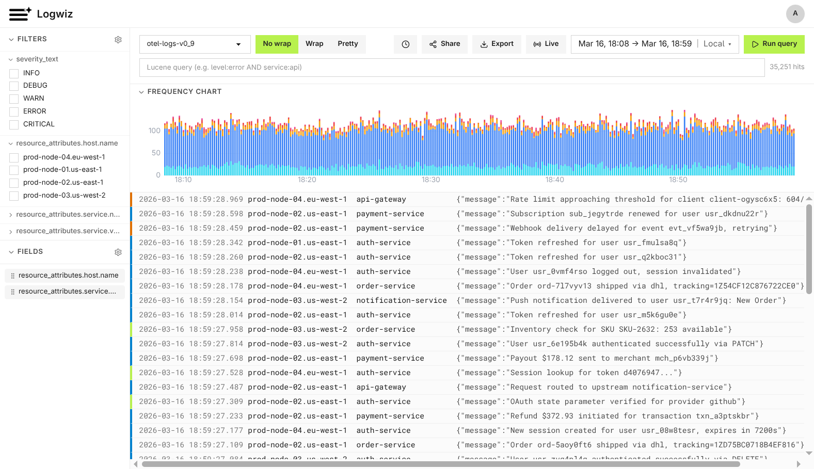

# Logwiz

Open-source logging UI for [Quickwit](https://quickwit.io). Search, filter, and visualize your logs with a modern web interface.



## Why Logwiz?

Quickwit is a powerful log search engine, but its built-in UI is minimal. Logwiz adds:

- **Saved queries** — bookmark and share frequently used searches
- **Quick filters** — one-click filtering by field values with aggregation counts
- **Log frequency histogram** — visualize log volume and severity distribution over time
- **Live tailing** — stream new logs in real-time
- **User management** — invite-based access control with admin/user roles
- **Configurable field mappings** — customize which fields display per index

## Quick Start

Requires [Docker](https://www.docker.com) and [Docker Compose](https://docs.docker.com/compose/).

1. **Clone and start:**

   ```bash
   git clone https://github.com/logwiz/logwiz.git
   cd logwiz
   docker compose up -d
   ```

2. **Open Logwiz:**

   Go to [http://localhost:3000](http://localhost:3000). Sign in with username `logwiz` and password `logwiz`. On first login, you'll be prompted to change it.

3. **Ingest sample data:**

   ```bash
   curl -X POST 'http://localhost:7280/api/v1/otel-logs-v0_9/ingest' \
     -H 'Content-Type: application/json' \
     -d '[{"timestamp_nanos":1710000000000000000,"severity_text":"INFO","body":{"message":"User logged in","user_id":"alice"}},{"timestamp_nanos":1710000060000000000,"severity_text":"ERROR","body":{"message":"Connection timeout","service":"api-gateway"}}]'
   ```

   Refresh Logwiz to see the logs appear.

## Configuration

Set environment variables in `docker-compose.yml` under the `logwiz` service.

### Connecting to an existing Quickwit instance

`LOGWIZ_QUICKWIT_URL` can point to any running Quickwit instance — not just the bundled one from docker-compose. Logwiz syncs available indexes from Quickwit on server startup, so restart the container to pick up new indexes.

### Environment variables

| Variable | Required | Default | Description |
|----------|----------|---------|-------------|
| `LOGWIZ_QUICKWIT_URL` | Yes | — | Quickwit API endpoint |
| `ORIGIN` | Yes | — | Server's public URL |
| `LOGWIZ_DATABASE_PATH` | No | `./data/logwiz.db` | Path to SQLite database |
| `LOGWIZ_ADMIN_EMAIL` | No | `logwiz@logwiz.local` | Default admin email |
| `LOGWIZ_ADMIN_USERNAME` | No | `logwiz` | Default admin username |
| `LOGWIZ_ADMIN_PASSWORD` | No | `logwiz` | Default admin password |
| `LOGWIZ_INVITE_EXPIRY_HOURS` | No | `48` | Invite token expiry (hours) |
| `LOGWIZ_RATE_LIMIT_WINDOW` | No | `60` | Rate limit window (seconds) |
| `LOGWIZ_RATE_LIMIT_MAX` | No | `100` | Max requests per window |
| `LOGWIZ_SIGNIN_RATE_LIMIT_MAX` | No | `5` | Max sign-in attempts per window |

### Resetting the admin password

1. Delete the admin user from the database:

   ```bash
   docker exec -it logwiz sqlite3 data/logwiz.db "DELETE FROM user WHERE role = 'admin';"
   ```

2. Restart the container:

   ```bash
   docker compose restart logwiz
   ```

3. A new admin is seeded automatically with the default credentials (`logwiz`/`logwiz`). You'll be prompted to change the password on first login.

## Local Development

Requires [Bun](https://bun.sh).

1. Start Quickwit:

   ```bash
   docker compose up quickwit -d
   ```

2. Install dependencies and set up the database:

   ```bash
   bun install
   cp .env.example .env
   bun run db:push
   ```

3. Start the dev server:

   ```bash
   bun run dev
   ```

   Open [http://localhost:5173](http://localhost:5173).

## License

[Apache License 2.0](LICENSE)
