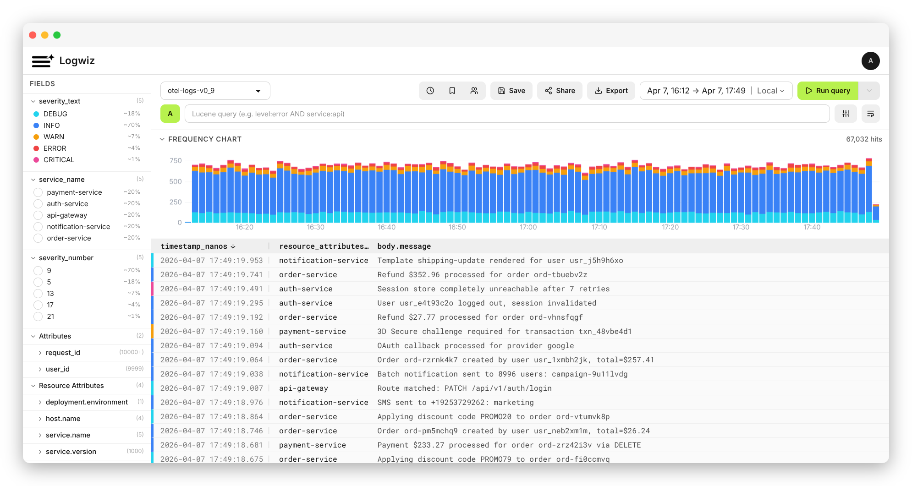

<div align="center">
  <h1>Logwiz</h1>
  <p>Open-source, self-hosted log management platform that allows you to run search directly on cloud storage.</p>

[](#)
[](https://github.com/oleksandr-zhyhalo/logwiz/releases)
[](LICENSE)

</div>

<div align="center">
  <picture>
    
  </picture>
</div>

- **Search & explore** — full-text log search, quick filters, and frequency histogram to visualize log volume over time
- **Saved queries & export** — bookmark searches, share them with your team, and download results as NDJSON, CSV, or plain text
- **HTTP ingest API** — authenticated endpoint that forwards logs to Quickwit
- **User management** — invite-based access control with optional Google Authentication

## Quick Start

```bash
curl -O https://raw.githubusercontent.com/oleksandr-zhyhalo/logwiz/main/docs-site/files/docker-compose.yml
docker compose up -d
```

For full installation options, see [docs.logwiz.io/install/docker-compose](https://docs.logwiz.io/install/docker-compose).

## Repository Layout

- `./` - the main Logwiz application
- `site/` - the marketing site  
- `docs-site/` - the documentation site built with Mintlify

## License

[Apache License 2.0](LICENSE)
