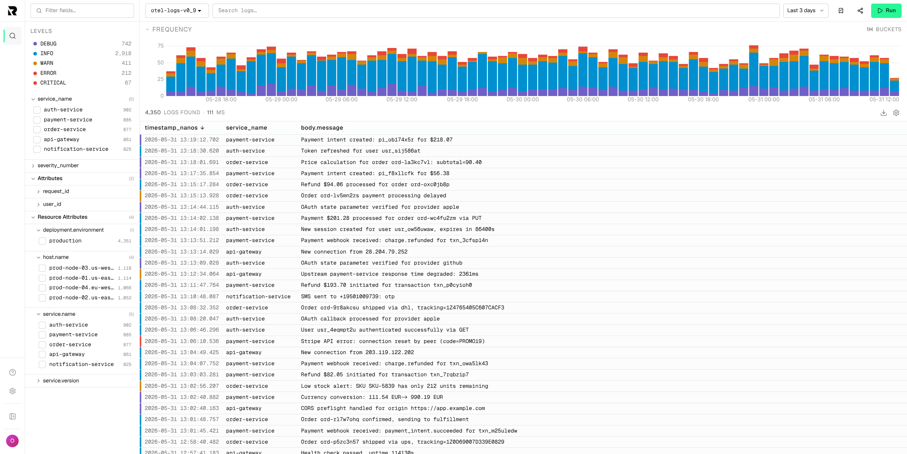

# Rootprint

Open-source, self-hosted log management with full-text search on object-storage-backed indexes.

Rootprint gives engineering teams a focused log search UI, OpenTelemetry ingestion, team access
control, and Quickwit-powered search without sending logs to a hosted SaaS.



## What You Get

- **Search on object storage** - Query Quickwit-backed indexes stored on S3, MinIO, R2,
  GCS, Azure Blob, or local disk.
- **Open ingestion** - Send logs through OTLP HTTP, NDJSON HTTP, Vector, Fluent Bit,
  Docker, Node.js, Python, Go, and other OTEL-compatible sources.
- **Incident-ready UI** - Use severity-aware rows, histograms, field filters, saved views,
  detail drawers, and share links.
- **Team access** - Invite users, manage roles, create scoped ingest keys, and enable Google
  or GitHub OAuth allowlists.
- **Admin controls** - Manage indexes, sources, field mappings, exports, activity, and
  Quickwit cluster health.
- **Open source** - Apache-2.0 licensed. Run it, inspect it, fork it.

## Quick Start

```bash
curl -o docker-compose.yml https://docs.rootprint.io/files/docker-compose.full.yaml
docker compose up -d
```

Open:

```text
http://localhost:8282
```

Then:

1. Create the first admin account.
2. Create an ingest key in **Settings -> Ingest keys**.
3. Send logs to the bundled OpenTelemetry index.
4. Search them from the Rootprint UI.

Full install guide: https://docs.rootprint.io/install/docker-compose

## Repository Layout

```text
apps/api   Hono API: ingest, search proxy, auth, admin operations
apps/web   SvelteKit SPA: log explorer and administration UI
```

## Local Development

```bash
bun install
cp .env.example .env
docker compose up -d db quickwit
bun --filter api db:migrate
bun run dev:api
bun run dev:web
```

Common checks:

```bash
bun --filter '*' check
bun run lint
bun run format:check
bun --filter api build
```

## Status

Rootprint is under active development and has not reached 1.0.

Expect breaking changes in APIs, configuration, storage schema, and runtime behavior between
releases. Pin exact versions and read the changelog before upgrading.

See [CHANGELOG.md](CHANGELOG.md).

## Documentation

- Docs: https://docs.rootprint.io
- Quickstart: https://docs.rootprint.io/quickstart
- Send logs: https://docs.rootprint.io/send-logs/overview
- API reference: https://docs.rootprint.io/api/overview
- Query syntax: https://docs.rootprint.io/search/query-language

## License

Apache-2.0. See [LICENSE](LICENSE).
